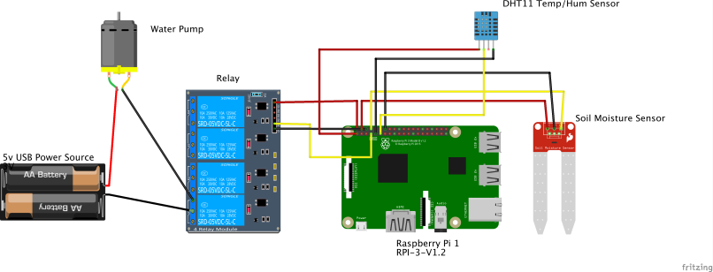
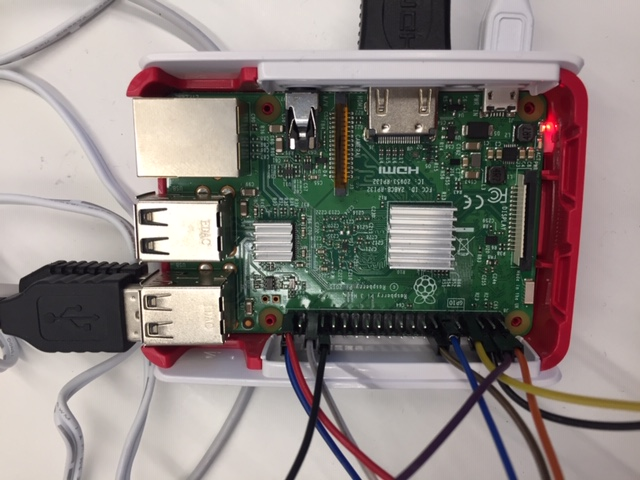
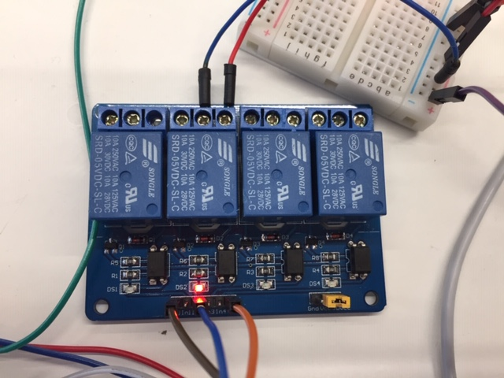
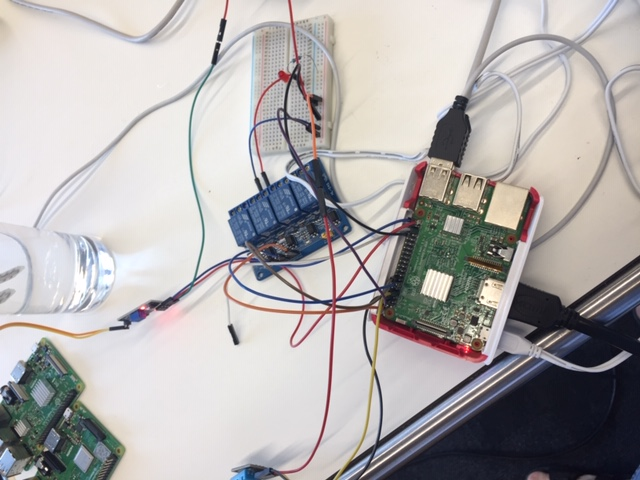

# Smart-Watering-System

## Verwendete Materialien: 
-	Raspberry Pi 3 – Model B+
-	DHT11 Sensor zum Messen der Temperatur und Luftfeuchtigkeit
-	Soil Moisture Sensor

## Der entwickelte Prototyp besteht aus 3 Bestandteilen:
- Hardware
- Python-Code zum Einlesen der Sensordaten, Steuerung der Pumpe und dem Senden der vom Frontend benötigten Daten an Pubnub 
- HTML5/JS-Code zur Echtzeit-Darstellung der Daten   
Der Sensor DHT11 misst sowohl die Temperatur als auch die Luftfeuchtigkeit. Damit der Raspberry Pi den Sensor nutzen kann, wird zu beginn die Bibliothek Adafruit_DHT importiert.  
Der Output des Feuchtigkeits-Sensors ist entweder 0V (trocken) oder 1V (feucht). Daher wird der Sensor als Button initialisiert. Die Pumpe wird als LED initialisiert, da sie ein binäres Signal erhält.
Je nach erforderlicher Darstellung der Daten im UI, müssen die Sensor-Daten unterschiedlich an das UI übergeben werden. Falls die Luftfeuchtigkeit und die Temperatur im selben Diagramm dargestellt werden sollen, müssen diese zuerst in ein Dictionary geschrieben werden.             
Zur Echtzeit-Darstellung der Daten wird Pubnub (Data streaming network infrastructure as a service IaaS) verwendet. Der Service benötigt zur Benutzung und der Verbindung zum Front-End einen Subscribe- und einen Publish-Key.

# Aufbau Hardware:

  *Aufbau Diagramm*

  *RP Ports*

  *Raspberry Pi 3 – Model B+*

  *Air Sensor*

  *Relay module*

  *Project*

  *Soil humidity Sensor*
